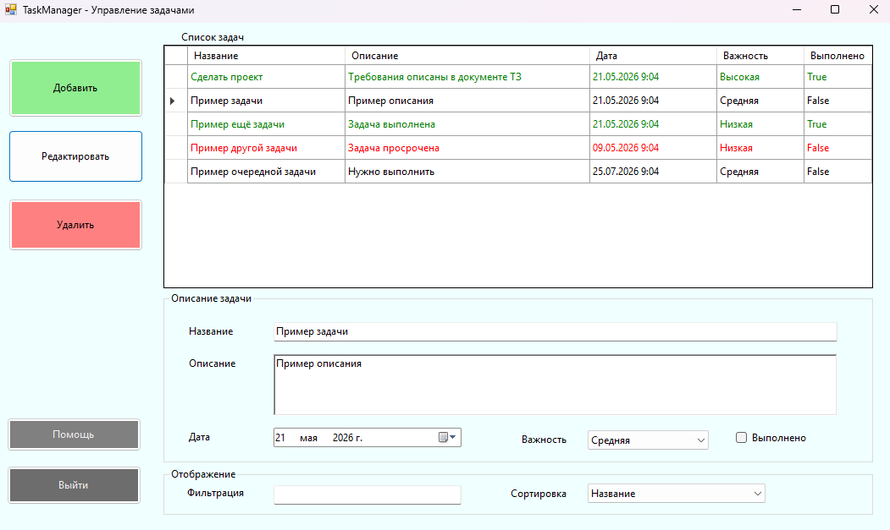

# TaskManager - Управление задачами 📝

Десктопное приложение для управления личными задачами, созданное в рамках учебного пет-проекта (с требованием выложить это в гитхаб).

## Возможности приложения
*   **Управление задачами:** добавление, редактирование и удаление задач.
*   **Детализация задач:** у каждой задачи есть название, описание, дата выполнения, приоритет и статус выполнения.
*   **Сортировка и фильтрация:** удобный поиск и упорядочивание списка.
*   **Цветовая индикация:** визуальное выделение дедлайнов и выполненных задач.
*   **Массовые операции:** поддержка массового удаления задач.

### Ограничения (по ТЗ):
*   Использованы только встроенные библиотеки **.NET**.
*   Никаких сторонних внешних зависимостей и NuGet-пакетов.
*   Базы данных не используются, весь код выполняется в рамках одного решения.

> Все данные хранятся только в оперативной памяти. Сохранения не происходит - при закрытии программы задачи удаляются.

---

## Системные требования
*   **Операционная система:** Windows
*   **Среда разработки:** Visual Studio
*   **Платформа:** .NET Framework 4.7.2
*   **Процессор:** желательно

## Инструкция по сборке
1. Скачайте репозиторий архивом (или клонируйте через Git).
2. Откройте с помощью Visual Studio файл решения `TaskManager.sln`.
3. Дождитесь загрузки проекта и нажмите `Ctrl + F5` для запуска приложения.

---

## Автор проекта
*   **Студент:** Махмуд Абвгдеейченко
*   **Курс:** 8 курс среднего профессионального образования (доброкачественного)
*   **Группа:** РиУПО-8БУ-177РМА-ЛДА